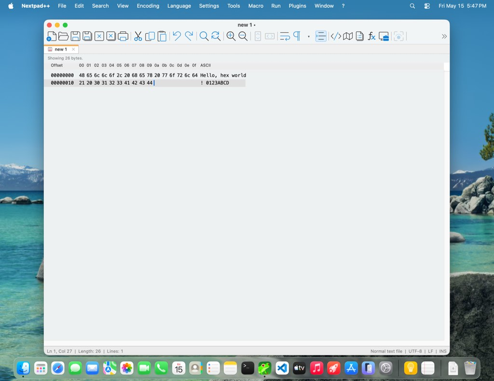
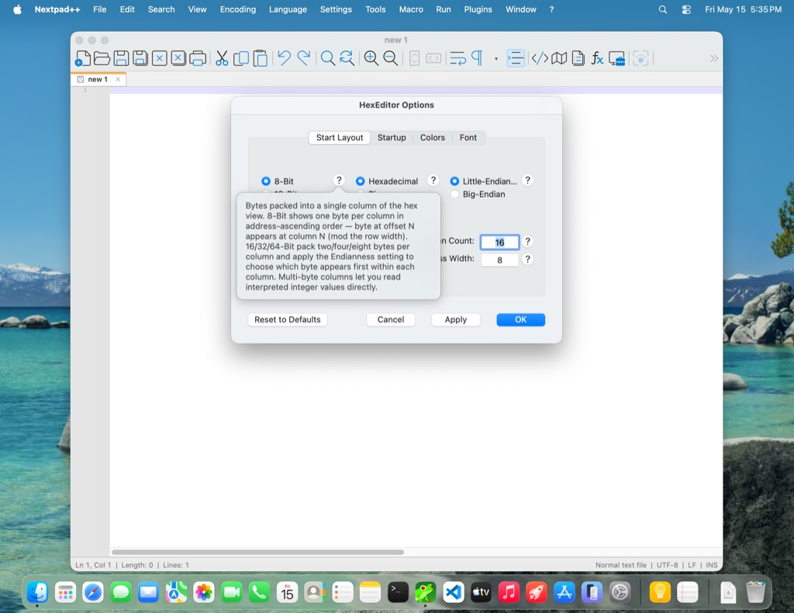
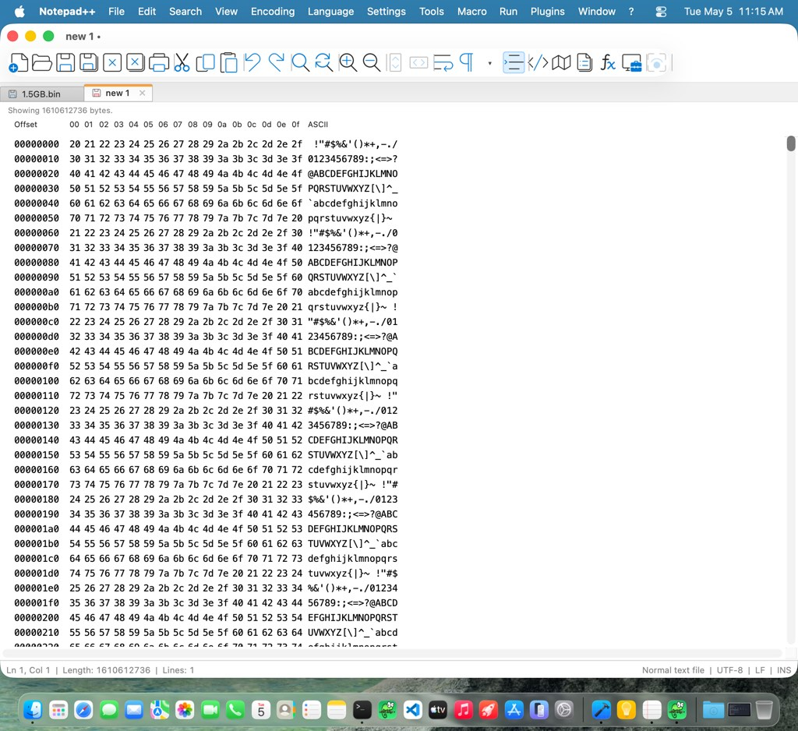
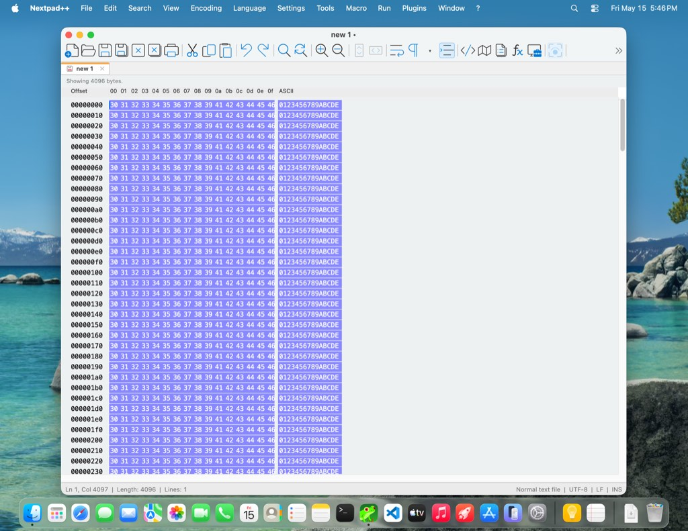

# HexEditor test status

_Generated: 2026-05-15 17:51 CDT · commit `48d631c4` · developer machine (no CI — UI tier needs the Parallels VM)._

## Tier status

| Tier                 | Status  | Duration | Last passed          | Notes                                                                     |
| :------------------- | :------ | -------: | :------------------- | :------------------------------------------------------------------------ |
| 1. Unit              | ✅ pass |    `<1s` | 2026-05-15 16:59 CDT | HexCore C++ assertions — 37/37 passing                                    |
| 2. Unit + ASan/UBSan | ✅ pass |    `<1s` | 2026-05-15 16:59 CDT | Same suite, AddressSanitizer + UndefinedBehaviorSanitizer — 37/37 passing |
| 3. Plugin smoke      | ✅ pass |    `<1s` | 2026-05-15 16:59 CDT | Plugin `dlopen` contract — 1/1 passing                                    |
| 4. Fuzz / robustness | ✅ pass |    4m 9s | 2026-05-15 16:59 CDT | libFuzzer harnesses × 30 s, ASan + UBSan — 8/8 passing                    |
| 5. XCTest UI (VM)    | ✅ pass |  47m 35s | 2026-05-15 16:59 CDT | XCTest UI on Parallels VM — 109/109 passing                               |

## XCTest UI tier

Latest run: **109** passed · **0** failed · **0** skipped · **109** total · 47m 22s at 2026-05-15 17:03 CDT

### Recent UI runs

| Date                 | Total | Pass | Fail | Skip | Duration |
| :------------------- | ----: | ---: | ---: | ---: | -------: |
| 2026-05-15 17:03 CDT |   109 |  109 |    0 |    0 |  47m 22s |
| 2026-05-15 10:22 CDT |   109 |  109 |    0 |    0 |  45m 56s |
| 2026-05-15 10:13 CDT |     2 |    0 |    2 |    0 |    33.9s |
| 2026-05-15 10:11 CDT |     2 |    0 |    2 |    0 |    34.1s |
| 2026-05-15 10:01 CDT |     2 |    2 |    0 |    0 |    32.3s |

For a full per-test breakdown including pass-rates and last-failure timestamps, run `macos/scripts/test-ui.sh --dashboard` locally (the per-test view is too large to commit).

## Representative UI screenshots

_A small curated subset. The full UI run produces ~25 diagnostic screenshots; committing all of them would balloon the repo. Run `macos/scripts/test-ui.sh --dashboard` locally for the full set._

### Hex view (default state)

### Options dialog with help tooltip

### Multi-GB file (1.5 GB) rendering

### Linear selection with mirrored hex / ASCII highlighting

---

This dashboard is regenerated by `macos/scripts/pre-commit-tests.sh` after each full pre-commit run and committed to the repo. There is no CI equivalent — the UI tier requires a Parallels VM that GitHub-hosted runners can't provide.
