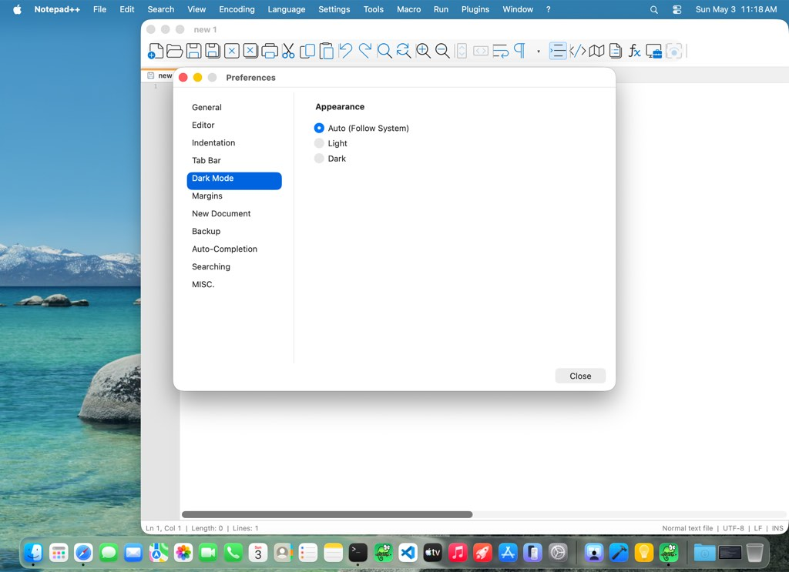
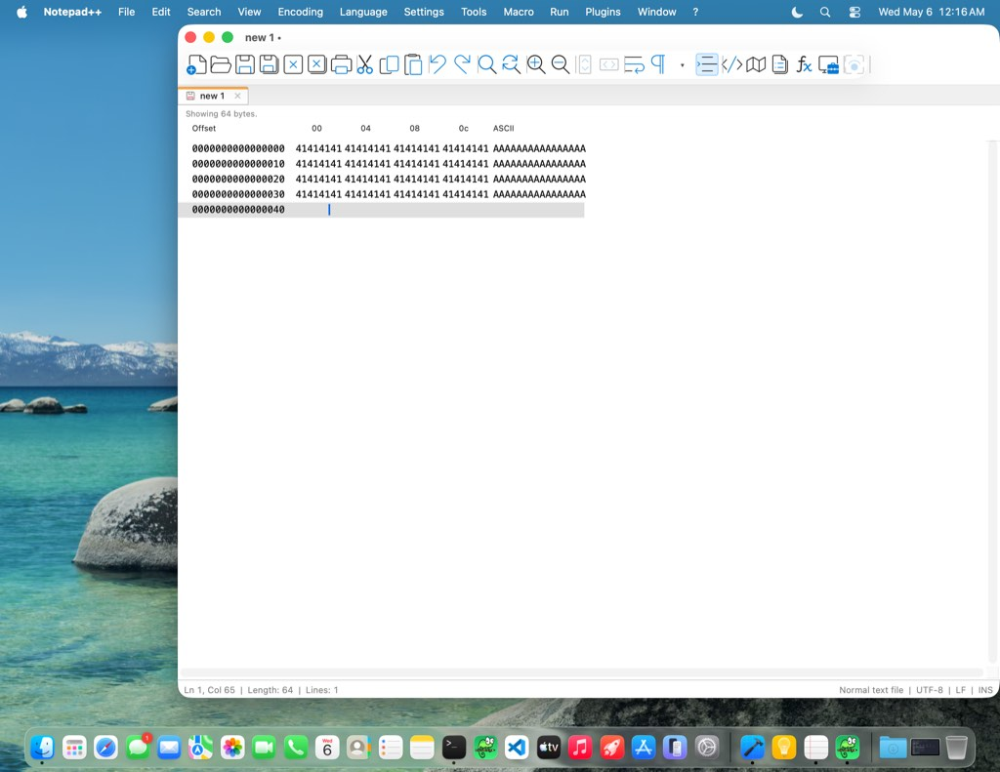

# HexEditor test status

_Generated: 2026-05-06 10:41 PDT · commit `93852c25` · developer machine (no CI — UI tier needs the Parallels VM)._

> **Note:** the most recent run was a `skip-ui` run. Tiers it skipped show their last-passed timestamp, not a fresh result.

## Tier status

| Tier | Status | Duration | Last passed | Notes |
|------|--------|---------:|-------------|-------|
| 1. Unit | ✅ pass | <1s | 2026-05-06 10:34 PDT | HexCore C++ assertions |
| 2. Unit + ASan/UBSan | ✅ pass | <1s | 2026-05-06 10:34 PDT | Same suite, AddressSanitizer + UndefinedBehaviorSanitizer |
| 3. Plugin smoke | ✅ pass | <1s | 2026-05-06 10:34 PDT | Plugin `dlopen` contract |
| 4. Fuzz / robustness | ✅ pass | 4m 8s | 2026-05-06 10:34 PDT | 8 libFuzzer harnesses × 30 s, ASan + UBSan |
| 5. XCTest UI (VM) | ⊘ skipped | — | — | XCTest UI on Parallels VM |

## XCTest UI tier

Latest run: **108** passed · **0** failed · **1** skipped · **109** total · 46m 20s at 2026-05-05 23:30 PDT

**Recent UI runs**

| Date | Total | Pass | Fail | Skip | Duration |
|------|------:|-----:|-----:|-----:|---------:|
| 2026-05-05 23:30 PDT | 109 | 108 | 0 | 1 | 46m 20s |
| 2026-05-05 23:23 PDT | 6 | 6 | 0 | 0 | 4m 47s |
| 2026-05-05 22:54 PDT | 5 | 1 | 4 | 0 | 3m 7s |
| 2026-05-05 22:08 PDT | 109 | 103 | 5 | 1 | 44m 31s |
| 2026-05-05 22:04 PDT | 3 | 3 | 0 | 0 | 43.6s |

For a full per-test breakdown including pass-rates and last-failure timestamps, run `macos/scripts/test-ui.sh --dashboard` locally (the per-test view is too large to commit).

## Representative UI screenshots

_A small curated subset. The full UI run produces ~25 diagnostic screenshots; committing all of them would balloon the repo. Run `macos/scripts/test-ui.sh --dashboard` locally for the full set._

### Hex view (default state)

### Dark appearance

### Wide-content horizontal scroll

### Options dialog

---

This dashboard is regenerated by `macos/scripts/pre-commit-tests.sh` after each full pre-commit run and committed to the repo. There is no CI equivalent — the UI tier requires a Parallels VM that GitHub-hosted runners can't provide.
